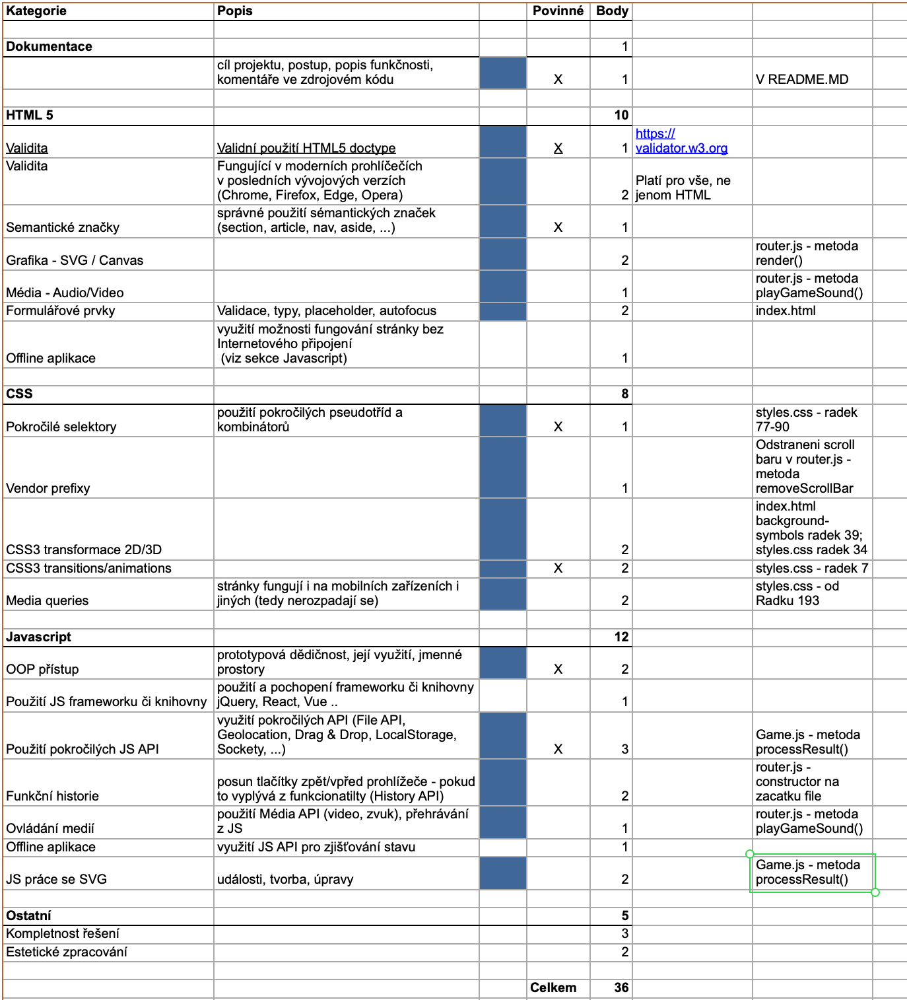

# KAJ

## Cil projektu
Tradicni hra Tic Tac Toe, ve ktere se kazdy z dvou hracu snazi vyhrat tim, ze dokaze shromazdit tri bunky vedle sebe (bud vertikalne, horizontalne nebo diagonalne).

## Postup
Pred pocatim hry musi hraci ulozit sva jmena. Po te mohou hraci hrat hru.
Jako prvni vzdy bude zacinat hrac, ktere si ulozil jmeno do pole s placeholderem username1. Po kazdem pohybu hrace se hraci stridaji dokola, dokud hra neskonci vitezstvim jednoho z hracu.
Po vyhre a skonceni hry se updatuje leaderboard, pokud se jeden z hracu dostal do top 10 hracu, nebo je list vyhercu kratsi nez 10. Hraci si ho mohou zobrazit prekliknutim zpatny na leaderboard. Pokud tak neucini, mohou hrat novou instanci hry se stejnymi jmeny, ktere meli v prvni hre po kliknuti na Play again tlacitko pod oznamenim vyherce.

## Popis funkcnosti
Stranka je vytvorena pomoci vice trid, ktere reprezentuji jednotlive stranky/sekce, se kterymi hrac muze v ramci teto single-page aplikace interagovat.
Pri hrani hry zacne hrat hudba. V pripade odchodu ze hry (jakkoli), hudba prestane hrat - tudiz jenom doprovazi tridu GamePage.
GamePage obsahuje nejvice logiky, ktera obstarava zobrazeni stranky hry.
Game class obsahuje veskerou logiku pro hrani hry.
LeaderboardPage obsahuje pouze logiku pro vykreslovani dat do tabulky odehranych vitezstvi a jmena vitezu (top 10). (Data se uchovavaji v localStorage)
Hra skonci vyhrou jednoho z uzivatelu nebo jejich odchozem ze stranky (celkove).

## Body za splneni

